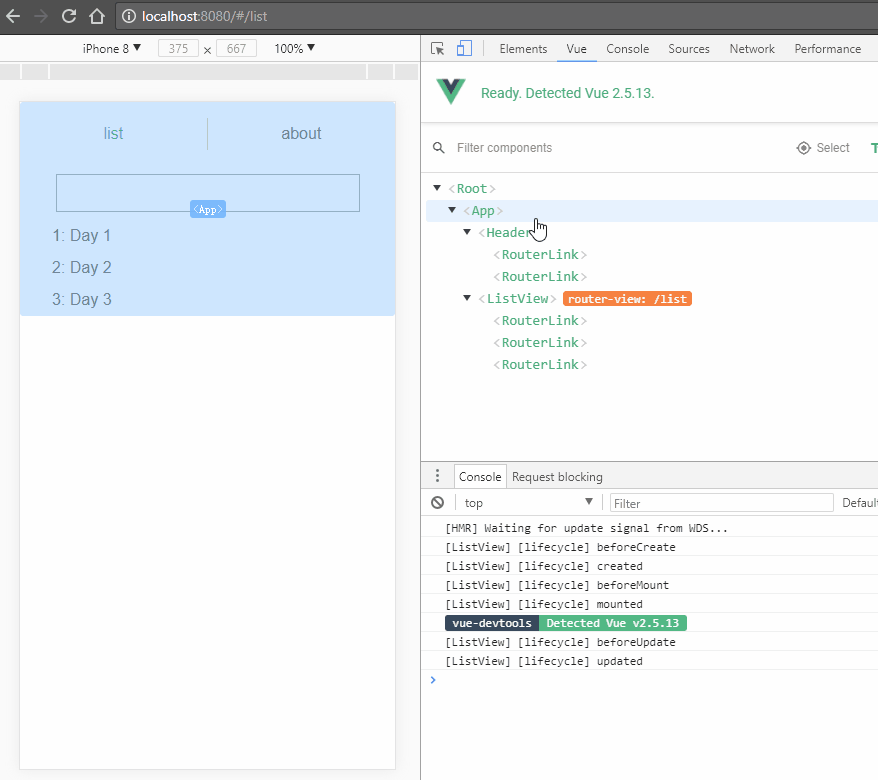

# vue-all

模板项目，用于快速开始使用Vue及Vue官方或推荐库开发建站。

## 架构特性

单页面应用，前端渲染页面组件、控制路由。使用vue、vue-loader、vue-router、vuex，结合webpack。

## 构建和启动命令

``` bash
# install dependencies
npm install

# serve with hot reload at localhost:8080
npm run dev

# build for production with minification
npm run build

# build for production and view the bundle analyzer report
npm run build --report

# run unit tests
npm run unit

# run all tests
npm test
```

详见[http://vuejs-templates.github.io/webpack/commands.html](http://vuejs-templates.github.io/webpack/commands.html)。

## 文件结构

| Path | Content |
| :--- | :--- |
| /src | 源码。 |
| /src/index.html | 主页面文件。 |
| /src/main.js | 主入口。 |
| /src/App.vue | 主组件。 |
| /src/router.js | 路由。 |
| /src/components | 组件。 |
| /src/assets | 资源文件。 |
| /src/store | Vuex状态存储。 |
| /static | 静态文件。 |
| /config | 构建配置。 |
| /build | 构建脚本。 |
| /test | 测试脚本。 |

## 快速开发

可参考示例代码进行组件、路由、状态数据的快速开发。



### 组件

在components文件夹下，每个文件夹是一个组件。

组件其实有不同类型，有的是页面模块，有的是复用的组件，有的甚至是纯功能性的（例如用作事件中心）。建议在命名和代码上加以区分。例如，用于全局挂载的组件，可以用G开头（表示global），导出为一个Vue插件。

在开发组件样式时，尽量使用[scoped](https://vue-loader.vuejs.org/en/features/scoped-css.html)将组件样式阻隔，避免css污染。对于需要渗透进子组件的样式，可使用`>>>`组合符。

对于.vue单文件格式的Vue组件，当组件代码规模足够大时，建议将script和style从.vue文件中分离。

组件间的事件通信、数据传递，可以有多种方法。对于父子组件，可以用props、事件emit等；对于非父子组件，可以用发布订阅模式实现event-bus（事件中心），或直接使用CustomEvent原生API；还可以使用状态管理器，例如Vue官方的状态管理器Vuex。

### 路由

在router.js文件中配置所有路由。请灵活使用嵌套路由、命名路由。

在组件中，router-view标签是路由匹配的组件的渲染容器，router-link标签是便于表示路由链接的组件（会被渲染为a标签）。

在进入某个路由后如果需要从服务器获取数据，有两种方式——在导航完成之前或者之后，详细参考[数据获取](https://router.vuejs.org/zh-cn/advanced/data-fetching.html)。

在组件实例被复用时，可通过两种方法——beforeRouteUpdate，或watch[路由对象](https://router.vuejs.org/zh-cn/api/route-object.html)——来响应路由参数的变化。

详细参考[vue-router](https://router.vuejs.org/zh-cn/essentials/getting-started.html)。

### 状态数据

在store文件夹下，index.js文件为主入口，其他文件都是全局状态下的module。

在编写Vuex部分的逻辑时，建议遵循以下几点原则：

* 由简到繁，循序渐进，不过早、过度设计
* 以业务和代码职能划分逻辑，以就近逻辑组织函数和模块
* 避免所有交叉逻辑

详细参考[Vuex](https://vuex.vuejs.org/zh-cn/getting-started.html)。

## 本地开发和测试

在build/webpack.dev.conf.js中，通过变量`devWebpackConfig`配置webpack-dev-server。

例如，通过`devServer.historyApiFallback`配置前端路由，通过`devServer.proxy`配置接口请求代理，通过`devServer.before`配置mock接口请求。

详细配置参考[DevServer](https://webpack.js.org/configuration/dev-server/#devserver-before)。

配置过程中，建议将路由、代理、mock接口从webpack配置中抽离。
